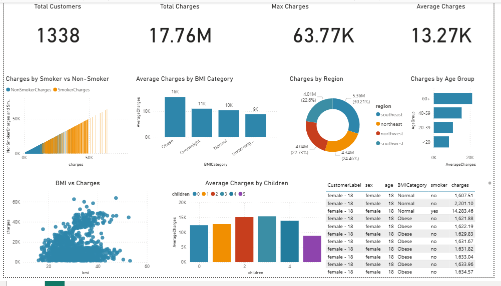

# 🏥 Medical Insurance Dashboard in Power BI  

## 🔹 Introduction  
Healthcare costs are a critical area of concern for insurers, policymakers, and individuals. Understanding how **demographics, lifestyle choices, and regional factors** affect medical charges can help in **pricing strategies, awareness campaigns, and healthcare planning**.  

This Power BI **Medical Insurance Dashboard** provides interactive insights into cost drivers, focusing on:  

- 👤 Age & Gender  
- ⚖️ Body Mass Index (BMI)  
- 👶 Number of Children  
- 🚬 Smoking Status  
- 🌎 Residential Region (US)  
- 💰 Charges (insurance costs billed)  

By transforming raw insurance data into meaningful visuals, this project enables decision-makers, analysts, and educators to explore **cost trends and key influencing factors**.  

---

## 🔹 Project Objectives 💡  
The main goals of this project are to:  

1. Visualize **total & average medical charges** across demographics.  
2. Compare **smokers vs non-smokers** and their impact on charges.  
3. Analyze the **relationship between BMI and costs**.  
4. Explore **regional variations** in insurance charges.  
5. Assess how **number of children** affects total medical costs.  
6. Identify **high-cost patient groups** for targeted analysis.  

---

## 🔹 Data Preparation ⚙️  

### 1. Dataset Used  
- **Table:** `insurance`  
- **Rows:** 1,338 individuals  
- **Columns:**  
  - `age` → Age of the insured  
  - `sex` → Gender (male/female)  
  - `bmi` → Body Mass Index  
  - `children` → Number of dependents  
  - `smoker` → Smoking status (yes/no)  
  - `region` → Residential region (northeast, northwest, southeast, southwest)  
  - `charges` → Medical insurance cost billed  

### 2. Feature Engineering  
- **BMI Category** → Grouped as Underweight, Normal, Overweight, Obese  
- **Age Group** → Categories: `<20`, `20–39`, `40–59`, `60+`  

### 3. Calculated Measures (DAX)  

**Total Charges**  
Total Charges = SUM(insurance[charges])
## 🔹 Dashboard Features 🎨  
The dashboard provides a **comprehensive view of insurance costs** with dynamic filtering and drill-down options.  

### 📈 Key Visuals  
- 💳 **Cards/KPIs** → Total Charges, Average Charges, Max Charges, % Smokers  
- 🚬 **Column Chart** → Charges by Smoker vs Non-Smoker  
- ⚖️ **Clustered Bar Chart** → Average Charges by BMI Category  
- 🗺️ **Donut Chart** → Charges distribution by Region  
- 👤 **Column Chart** → Charges by Age Group  
- 📊 **Scatter Plot** → BMI vs Charges (clustered by smoker status)  
- 👶 **Stacked Column Chart** → Charges by Number of Children  
- 🌳 **Decomposition Tree** → Explore Charges by **Smoker → BMI → Region → Sex**  
- 📑 **Table** → Individual details (Age, Sex, BMI, Smoker, Region, Charges) with conditional formatting  

### 🎛️ Slicers & Filters  
- Demographics → Age Group, Gender  
- Lifestyle → Smoker, BMI Category  
- Geography → Region  

---

## 🔹 Tools & Technologies 🛠️  
- **Power BI Desktop** → Dashboard building & visualization  
- **Power Query** → Data cleaning, transformations  
- **DAX** → Calculated measures and KPIs  

---

## 🔹 Conclusion 🏁  
This **Medical Insurance Dashboard** empowers:  

✔ Insurers to **analyze cost drivers** and adjust pricing models.  
✔ Policymakers to **design targeted healthcare interventions**.  
✔ Analysts to **uncover patterns in healthcare affordability**.  
✔ Educators to **teach regression and feature engineering** using real-world data.  

By turning raw insurance data into interactive analytics, this project highlights the **importance of data-driven insights in healthcare economics**.  

---

## 🔹 Future Enhancements 🚀  
- 📆 Add **time-series data** to track charges over years.  
- 🤖 Integrate **predictive models** for cost forecasting.  
- 🔎 Build **drill-through pages** for patient-level analysis.  
- 📡 Connect with **real-world APIs** for live healthcare data.  

## 📸 Dashboard Preview

